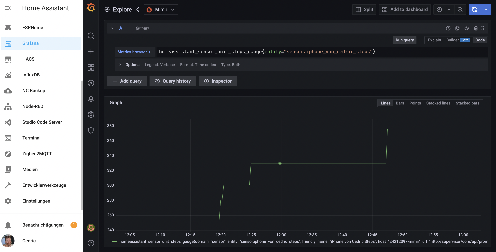

# Grafana Mimir Home Assistant add-on repository

Use Grafana Mimir with HomeAssistant

## Add-ons

This repository contains the following add-ons

### [Grafana Mimir](./mimir)

![Supports aarch64 Architecture][aarch64-shield]
![Supports amd64 Architecture][amd64-shield]

[aarch64-shield]: https://img.shields.io/badge/aarch64-yes-green.svg
[amd64-shield]: https://img.shields.io/badge/amd64-yes-green.svg
